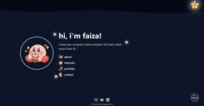

# 🌊 underwater portfolio

a creative personal portfolio designed as an interactive underwater experience, combining animations, sound, and playful ui.

## ✨ technologies

- react.js  
- css3  
- javascript  
- [react wavify](https://www.npmjs.com/package/react-wavify)

## 🚀 features

- day/night mode toggle with sound effects  
- animated wave background  
- floating ui elements and micro-interactions  
- window-based navigation system  
- responsive design  

## 🎞️ preview

## 📍 the process

when i was exploring different portfolios for inspiration i found this really helpful video made by [shar](https://www.youtube.com/watch?v=_tWh4cYCTv0&t=694s). i too wanted to build something that didn’t feel like a traditional portfolio. most portfolios are structured and predictable, so i experimented with a more immersive and expressive design. 

i liked the react-wavify component showed in the video, and when i was trying to design the basic layout of portfolio i decided to go with the underwater theme because it felt calm. i focused on small details like floating elements, subtle animations, and sound feedback to make the experience feel alive.

this project became more about exploring how ui and interaction design can shape user experience rather than just displaying information.

## 📚 what i learned

- designing interactive ui beyond standard layouts  
- managing component state for dynamic ui  
- enhancing ux using sound and animation  
- building visually cohesive themes  

## ⚠️ usage

this project is for personal portfolio use only.

you may use it as inspiration but, please do not copy or reuse the design/code without permission.
